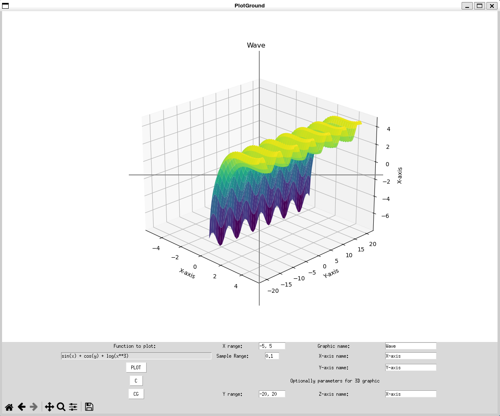

# PlotGround
#### Demo:  [YouTube Video](https://www.youtube.com/watch?v=Zr-8NJPAjaE)
#### Description:
Software to plot 2D graphs also supports surface graphs in 3D.
Developed with Python using *Tkinter* for interface and *Matplotlib*.



### Usage Explanation
```python
python main.py
```
- **PLOT button**: plot data. For default you can plot many graphics in the same plot until you remove plots with **CG** or changing type of plot, from 2D to surface in 3D and vice versa.

- **Funtion field**: insert a valid function to plot in 2D with only **x** variable is allowed (`y = f(x)`), or surface to plot in 3D wich **x** and **y** variables only are supported (`z = f(x, y)`). All the variables and following functions are  case insensitive. Functions and constant built-in supported are:
    * sin()
    * cos()
    * tan()
    * sqrt() (square root)
    * *e*, *pi* constants
    
    examples: 
        2D plot = `sin(x) + 10`, `cos(x**2)`, `sqrt(1/7)`, `e**x`
        3D plot = `sin(x) + cos(y)`, `x**2 + y + 10`

- **C button**: clear all fields.

- **CE button**: clear all plots.

- **Range X or Range Y**: Optionally insert a valid range of **x** and **y** (`1, 10` for default) as integers separeted with comma.

- **Sampling Interval**: Optionally insert a valid sampling interval (**0.01** for dafault).

- **Title and axis names**: Optionally insert name of axis and graphic.

### Code explanation
- `main.py`
Execution file. First create a frame and figure, put them together with **canvas**. Later calls `App` class from `app.py`

- `app.py`
Contains `App` class within:
    1. creates *tkinter* interface along `__init__` method,
    1. `represent` method which retrieve inputs from the user and prompt errors if user input something wrong,
    1. `animate` method plots data based on input user. If *x range* or *y range* wasn't provided, `[1, 10]` limits for deafult are taken. If *sampling interval* wasn't provided, `0.01` value is adopted. Plots surface in 3D if the user input function contains at least one *y* variable, if not try to plot in 2D along *x* var,
    1. `graphs_clear` delete axis object just to reset plotting view,
    1. `fields_clear` reset all input fields.
